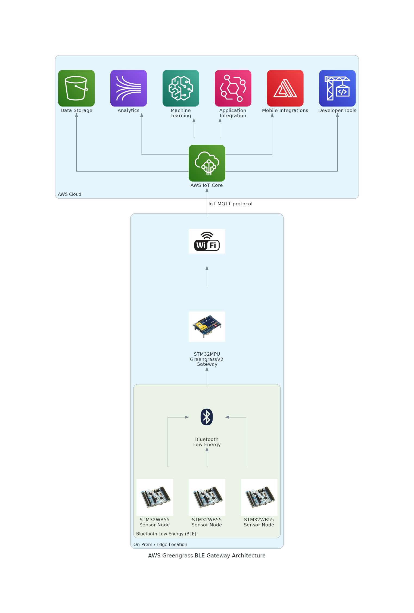
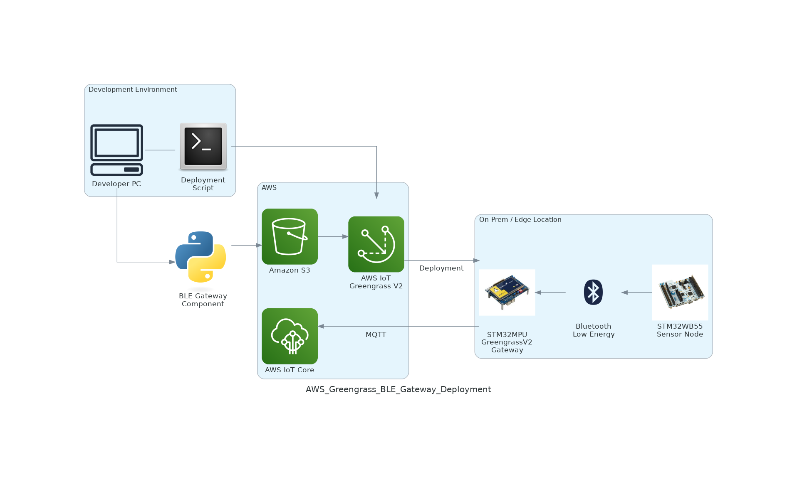
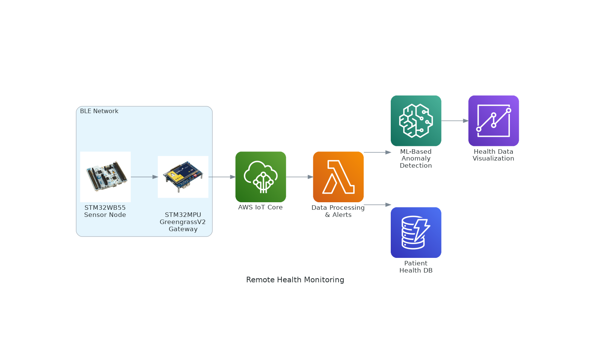
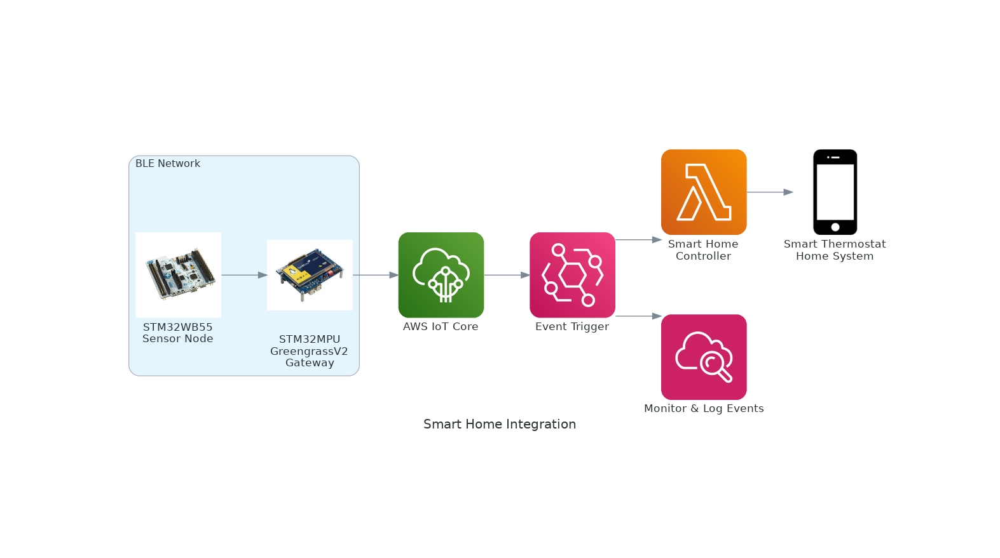
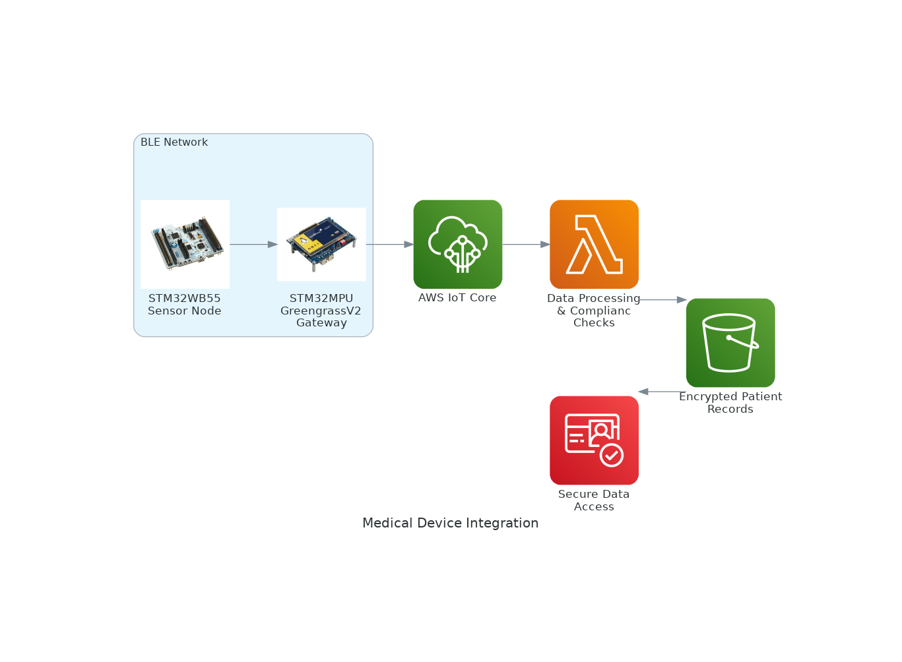
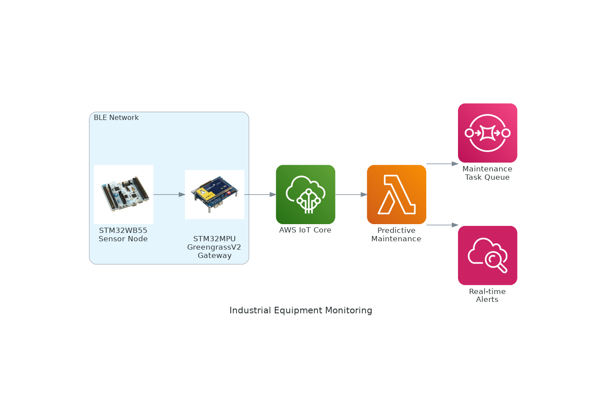
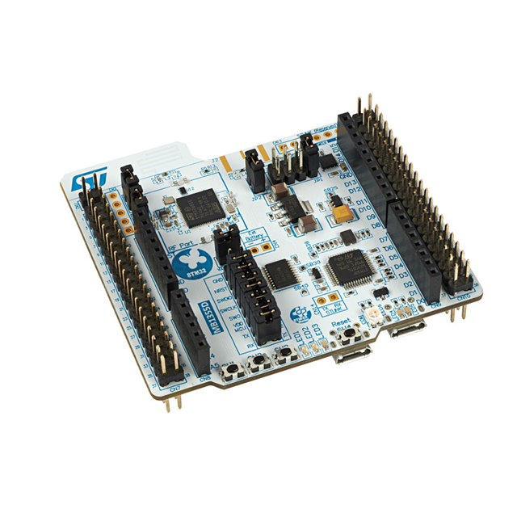
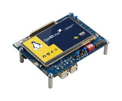
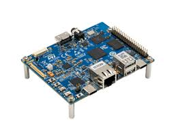

# AWS IoT Greengrass BLE Sensor Gateway

## Introduction

Bluetooth Low Energy (BLE) sensor nodes are increasingly utilized across a wide range of applications, including health and wellness, industrial, and environmental monitoring. These devices typically operate with short-range communication, making them ideal for localized data collection in diverse environments. The **AWS IoT Greengrass BLE Sensor Gateway** enables seamless communication between BLE sensor nodes and AWS cloud services through a Linux-based MPU platform. This solution allows users to securely collect data from a variety of BLE-enabled sensor nodes and transmit it to AWS IoT Core for further processing, analytics, and integration with other AWS services.



In this solution, the **[STM32WB](https://www.st.com/en/microcontrollers-microprocessors/stm32wb-series.html)** series microcontroller acts as the BLE node, transmitting sensor data. The application securely transmits data from the STM32WB devices to AWS IoT Core for processing, analytics, and integration with other AWS services. Additionally, the solution supports remote deployment to **[STM32MPU](https://www.st.com/en/microcontrollers-microprocessors/stm32-arm-cortex-mpus.html)** devices operating **[Greengrass V2](https://docs.aws.amazon.com/greengrass/v2/developerguide/what-is-iot-greengrass.html)** in the field, providing flexibility for managing remote and distributed sensor networks.

### What is AWS IoT Greengrass?

AWS IoT Greengrass is a service that extends AWS to edge devices, allowing them to act locally on the data they generate. It enables local execution of AWS Lambda functions, message brokering, data caching, and synchronization with AWS cloud services, even when the devices are offline. Greengrass helps you manage remote devices at scale, securely deploy applications, and keep devices up-to-date with remote software updates. 

### AWS IoT Greengrass Remote Deployment

The **BLE Gateway** is packaged as an **[AWS IoT Greengrass V2 component](https://docs.aws.amazon.com/greengrass/v2/developerguide/greengrass-components.html)**, enabling seamless **[remote deployment](https://docs.aws.amazon.com/greengrass/v2/developerguide/create-deployments.html)** onto **STM32MPU** devices with the provided `deploy.sh` script. 
This setup allows you to:

1. **Manage Devices at Scale**: Easily deploy and manage your sensor networks in remote locations without requiring direct interaction with each device.
2. **Real-time Monitoring**: Continuously collect data from sensors in the field and monitor it in real time in **AWS IoT Core**.
3. **Remote Firmware Updates**: Push updates to devices remotely, ensuring they remain up-to-date with minimal intervention.
4. **Edge Computing**: Run **AWS Lambda** functions on the edge to process data locally, reducing latency and bandwidth usage by sending only relevant data to the cloud.

#### Deployment Process:



1. **Developer Prepares the Component**:
   - The **Developer PC** clones this **BLE Gateway Component**.
   

2. **Upload the Component to Greengrass**:
   - The developer uploads the component artifacts to **Amazon S3**.

3. **Greengrass Deploys to the Gateway Device**:
   - The developer interacts with **AWS Greengrass** to deploy the **BLE Gateway Component** to the **STM32MPU Gateway Device**.

4. **Communication with BLE Sensor Nodes**:
   - The **Gateway Device** begins scanning for nearby **BLE Sensor Nodes** (e.g., health thermometers or other BLE devices).
   - The gateway securely collects BLE sensor data.

5. **Data Transmission to AWS IoT Core**:
   - The **Gateway Device** formats sensor data into MQTT messages, and sends it to AWS IoT Core over the internet.
   - **AWS IoT Core** can be used for further processing, analysis, and integration with other AWS services.

This deployment process ensures you can manage remote sensor networks at scale, monitor data in real-time, and update devices remotely with minimal physical intervention, making it ideal for both on-premise and edge use cases.

---

## Use-Cases

This project serves as a proof of concept, collecting data from BLE devices using the Health Thermometer Service UUID. However, it can be easily adapted for a wide range of BLE sensor node applications. Some potential use cases include:

- **Remote Health Monitoring**: Gather temperature data from personal or home-based health thermometers, leveraging AWS services to analyze trends, detect anomalies, and offer remote health insights.

- **Smart Home Integration**: Seamlessly connect BLE thermometers with smart home systems to trigger automatic actions, such as adjusting heating or cooling based on temperature readings.

- **Medical Device Integration**: Enable BLE-enabled medical devices to send data to AWS IoT Core, facilitating centralized data management, real-time analytics, and improved patient care.

- **Industrial Equipment Monitoring**: Integrate BLE-enabled sensors with industrial machinery to monitor operating conditions in real-time. Data can be sent to AWS IoT Core for predictive maintenance, alerting operators to abnormalities, thereby reducing downtime and maintenance costs.


---

## **Technical Overview**

This gateway is a Python-based application packaged as an **[AWS IoT Greengrass V2 component](https://docs.aws.amazon.com/greengrass/v2/developerguide/greengrass-components.html)** for **STM32MPU devices**. It enables **STM32MPU devices** to communicate with nearby **BLE sensor nodes**. The component is **[deployed remotely](https://docs.aws.amazon.com/greengrass/v2/developerguide/create-deployments.html) from the developer's PC** to the STM32MPU board, allowing it to function independently in the field, providing seamless data collection and communication with AWS IoT Core.

Key features of the component include:

- **BLE Device Scanning**: The component uses the **[Bleak](https://bleak.readthedocs.io/en/latest/)** library to scan for nearby BLE devices that advertise specific service **UUIDs (Universially Unique Identifiers)** (e.g., Health Thermometer Service or any custom BLE Sensor Node service UUID).
   - **Health Thermometer Service UUID**: By default, the component scans for the **Health Thermometer Service UUID** (`00001809-0000-1000-8000-00805f9b34fb`), which is the standard UUID for health thermometer devices as defined in the **[Health Thermometer Profile](https://wiki.st.com/stm32mcu/wiki/Connectivity:STM32WBA_Health_Thermometer#Health_Thermometer_Profile)**. This service enables the collection of temperature data from BLE-enabled health thermometers, and is supported in the provided `BLE_HealthThermometer.bin` firmware. The UUID can be changed in the component’s configuration if you need to scan for other custom services or BLE sensor nodes that use different service UUIDs.
  
- **Temperature Data Collection**: It collects temperature data or other sensor information from BLE-enabled devices and formats the data into structured **JSON MQTT messages**.

- **Secure MQTT Communication**: The component uses the **[Paho-MQTT](https://pypi.org/project/paho-mqtt/)** library along with **TLS encryption** to securely send data to AWS IoT Core via the MQTT protocol.

- **AWS IoT Integration**: Data collected from BLE devices is published to **AWS IoT Core** in real time, where it can be further processed, analyzed, and integrated with other AWS services for monitoring, analytics, and decision-making.

By packaging this functionality as an AWS Greengrass component, developers can deploy and manage the gateway remotely, without needing direct access to each device in the field, ensuring scalability and ease of maintenance.

### MQTT Message Structure

Once the sensor data is collected from the BLE device, it is formatted as a structured JSON object before being published to the MQTT broker. The message contains several key data fields:

1. **`device_name`**: A unique identifier for the device sending the data (e.g., "Thermometer1").
2. **`device_address`**: The Bluetooth address of the BLE device (e.g., "A0:23:41:89:56:3C").
3. **`temperature`**: The actual temperature reading from the device (e.g., 22.5).
4. **`unit`**: The unit of temperature measurement, determined by flags in the BLE data (e.g., "Celsius" or "Fahrenheit").
5. **`timestamp`**: The timestamp of when the data was collected, represented as a floating-point number denoting the time.

The message is formatted as follows:

```json
{
  "device_name": "HTSTM",
  "device_address": "A0:23:41:89:56:3C",
  "temperature": 39,
  "unit": "Celsius",
  "timestamp": 1617289258.93842
}
```

After the message is prepared, it is serialized into a JSON string and published to the MQTT broker. The topic for the message is dynamically generated based on the device's name and address. For instance, the topic could look like this:

```
HTSTM/temp/A0:23:41:89:56:3C
```

The MQTT message is then securely transmitted to the AWS IoT Core MQTT broker, where it can be processed further, logged, or integrated with other cloud-based services.

### Summary

- The Greengrass BLE Gateway component is deployed onto an STM32MPU device. 
- The STM32MPU then periodically scans for BLE sensor nodes advertising specific UUIDs.
- The STM32MPU loops through avaialbale BLE devices collecting sensor data.
- The data is structured as a JSON message and sent securely to AWS IoT Core via MQTT.
- The integration with AWS IoT Core allows for real-time processing and analytics.

---

## **Project Structure**

```plaintext
GG_BLE_Gateway/
├── BleGatewayComponent/
│   ├── artifacts/
│   │   └── com.example.BleGateway/
│   │       └── 1.0.0/
│   │           ├── BleGateway.py                  # Main BLE gateway script
│   │           └── install.sh                     # Dependency installation script
│   └── recipes/
│       └── com.example.BleGateway-TEMPLATE.yaml   # Greengrass component recipe template
├── BLE_HealthThermometer.bin                      # STM32WB55 Nucleo BLE Firmware
├── config.json                                    # Deployment configuration file
└── deploy.sh                                      # Deployment script
```

### **Key Files**
- **`BleGatewayComponent/`**: Contains the Greengrass component's recipe and its artifacts.

- **`install.sh`**: Installs complete version of Python3, Pip3, [Bleak](https://bleak.readthedocs.io/en/latest/), and [Paho-Mqtt](https://pypi.org/project/paho-mqtt/) if not present 
- **`deploy.sh`**: Automates AWS Greengrass Deployment of BLE Gateway Component. Depends on [AWS CLI](https://docs.aws.amazon.com/cli/latest/userguide/cli-chap-getting-started.html). 
- **`config.json`**: Configuartion script for deploy.sh. 
---

## **Required Software and Hardware**

### 1. **STM32WB BLE Devices:**
   - **Compatible Devices:**  
     - Any BLE-enabled device that supports GATT profiles.  
     - This code has been tested with the **[STM32WB55 Nucleo](https://www.st.com/en/evaluation-tools/p-nucleo-wb55.html)** board running the **[Health Thermometer Sensor Example](https://wiki.st.com/stm32mcu/wiki/Connectivity:STM32WBA_Health_Thermometer)** firmware provided.

   <div style="text-align:center;">
     
   </div>

   - **Compatible Firmware:**  
     - You can flash the prebuilt **Health Thermometer Service** firmware to the **STM32WB55 Nucleo** board by simply dragging and dropping the [BLE_HealthThermometer.bin](BLE_HealthThermometer.bin) file onto the board. This allows you to skip the build process.  
     - For build instructions and more example projects, check out the official **STM32WB** BLE resources:  
       - [STM32WB BLE Project Examples](https://wiki.st.com/stm32mcu/wiki/Connectivity:STM32WB_Build_BLE_Project)

### 2. **STM32MPU Boards (Greengrass-Compatible):**
   - A **Greengrass-compatible** STM32MPU board is required for deployment.
   - Supported STM32MPU boards include:

   <div style="text-align:center;">
     
   </div>

   - **[STM32MP135F-DK](https://www.st.com/en/evaluation-tools/stm32mp135f-dk.html)**  

   <div style="text-align:center;">
     
   </div>

   - **[STM32MP257F-DK](https://www.st.com/en/evaluation-tools/stm32mp257f-dk.html)**  

### 3. **AWS CLI (Command Line Interface):**
To interact with AWS services from the terminal, you need to have the AWS CLI installed and configured.

   - **Installation:**  
   Follow the official [AWS CLI installation guide](https://docs.aws.amazon.com/cli/latest/userguide/getting-started-install.html) for your operating system.

   - **Configuration:**  
   After installing the AWS CLI, you must configure it with your AWS credentials (access key and secret key):
      1. Run the [aws configure](https://docs.aws.amazon.com/cli/latest/reference/configure/) command:
         ```bash
         aws configure
         ```
      2. You will be prompted to enter:
         - **AWS Access Key ID** (see [AWS docs](https://docs.aws.amazon.com/IAM/latest/UserGuide/id_credentials_access-keys.html))
         - **AWS Secret Access Key** (see [AWS docs](https://docs.aws.amazon.com/IAM/latest/UserGuide/id_credentials_access-keys.html))
         - **Default region name** (e.g., `us-west-2`)
         - **Default output format** (e.g., `json`)

---

## **Setup Instructions**

### **1. Clone This Repository**

   ```bash
   git clone https://github.com/AlnurElberier/GG_BLE_Gateway.git
   ```

### **2. Flash Firmware to STM32WB Sensor Node**

   **Drag and Drop the Binary**  
   - Connect the STM32WB board to your computer via USB.
   - Drag and drop the provided `BLE_HealthThermometer.bin` firmware file onto the board.


### **3. Register Your STM32MPU Board as an AWS IoT Greengrass Lite Device**
   
   **[STM32MP13_AWS-IoT-Greengrass-nucleus-lite](https://github.com/stm32-hotspot/STM32MP13_AWS-IoT-Greengrass-nucleus-lite)**  
      A lightweight approach to setting up AWS IoT Greengrass on STM32MP1 devices.

### **4. Deploy the Component**
   The BLE Gateway Component is packaged as a Greengrass V2 Component and deployment is automated with **`deploy.sh`**. 

   1. **Configure `config.json`**
      The `config.json` file contains essential parameters for deploying the **BleGateway** component using AWS Greengrass. Follow the instructions below to correctly populate the fields.  

      ##### **Example `config.json` File**
      ```json
      {
         "TARGET_NAME": "MyGreengrassDevice",
         "BASE_BUCKET_NAME": "ble-gateway",
         "REGION": "us-west-2",
         "VERSION": "1.0.0",
         "COMPONENT_NAME": "com.example.BleGateway"
      }
      ```

      ##### **Parameter Descriptions**
      | **Key**              | **Description** |
      |----------------------|---------------|
      | `TARGET_NAME`       | The name of the AWS IoT Thing or Group that will receive the Greengrass deployment. Example: `"MyGreengrassDevice"` or `"MyGreengrassGroup"`. |
      | `BASE_BUCKET_NAME`   | The base name for the AWS S3 bucket where artifacts will be stored. Your AWS account ID will be appended to this name automatically. |
      | `REGION`            | The AWS region where your resources (S3 bucket, Greengrass component, IoT Thing) are located. Example: `"us-west-2"`. |
      | `VERSION`          | The version number of the component. This should match the version of your deployment. Example: `"1.0.0"`. |
      | `COMPONENT_NAME`    | The name of the AWS Greengrass component being deployed. Example: `"com.example.BleGateway"`. |


      >##### **Notes:**
      >- Ensure that **`BASE_BUCKET_NAME`** is unique across AWS (your account ID helps with this).  
      >- The **`TARGET_NAME`** should match an existing AWS IoT Thing **OR** Group Name.
      >- **Creating New Versions or Modifying Artifacts:**  
      >     - If you create a new version or modify artifacts (e.g., `BleGateway.py`, `install.sh`), place them in a directory corresponding to the new version.  
      >     - The script expects artifacts to be in:  
      >        ```./BleGatewayComponent/artifacts/com.example.BleGateway/<VERSION>/```
      >     - This ensures the deployment script can find and upload the correct files.

   2. **Run `Deploy.sh`**

      ##### **Prerequisites**  
      - **AWS CLI** [installed](https://docs.aws.amazon.com/cli/latest/userguide/install-cliv2.html) and [configured](https://docs.aws.amazon.com/cli/latest/reference/configure/).  
      - A properly filled `config.json`

      ##### **Running the Script**  
      ```sh
      cd GG_BLE_GATEWAY
      chmod +x deploy.sh  # Ensure it's executable (only needed once)
      ./deploy.sh
      ```
      This will:  
      - Load settings from `config.json`.  
      - Upload artifacts (`BleGateway.py`, `install.sh`) to S3.  
      - Update the component recipe.  
      - Create and deploy the component in AWS Greengrass.  

### **5. Viewing MQTT Messages in AWS IoT Core**  

   To monitor and debug MQTT messages from your AWS Greengrass BLE Gateway, use the AWS IoT MQTT test client:  

   1. **Open AWS IoT Core**  
      - Sign in to the [AWS IoT Console](https://console.aws.amazon.com/iot).  
      
   2. **Access the MQTT Test Client**  
      - In the left navigation pane, select **Test** under **Message Routing**.  
      
   3. **Subscribe to Topics**  
      - Enter the topic filter (e.g., `HTSTM/temp/`) and choose **Subscribe to topic**.  
      
   4. **Publish and View Messages**  
      - Monitor incoming messages or send test messages to your IoT Core topics.  

   For detailed instructions, refer to the [AWS documentation](https://docs.aws.amazon.com/iot/latest/developerguide/view-mqtt-messages.html).  

---

## **Contributing**
Contributions are welcome! If you'd like to improve the repository or add new features, feel free to open a pull request or submit an issue.
